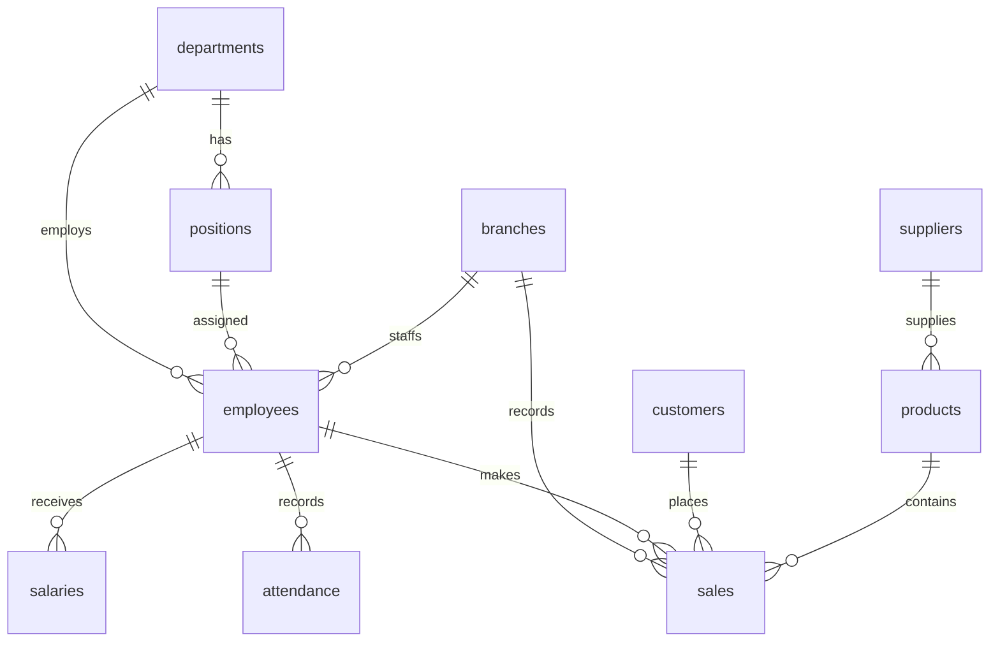

```mermaid
erDiagram
    departments ||--o{ positions : has
    departments ||--o{ employees : employs
    positions ||--o{ employees : assigned
    branches ||--o{ employees : staffs
    employees ||--o{ salaries : receives
    employees ||--o{ attendance : records
    suppliers ||--o{ products : supplies
    branches ||--o{ sales : records
    employees ||--o{ sales : makes
    customers ||--o{ sales : places
    products ||--o{ sales : contains
```
